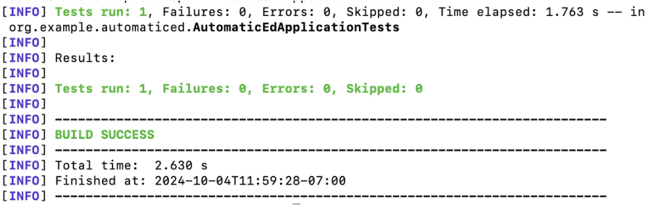
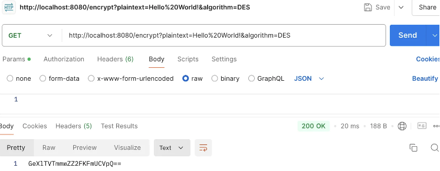
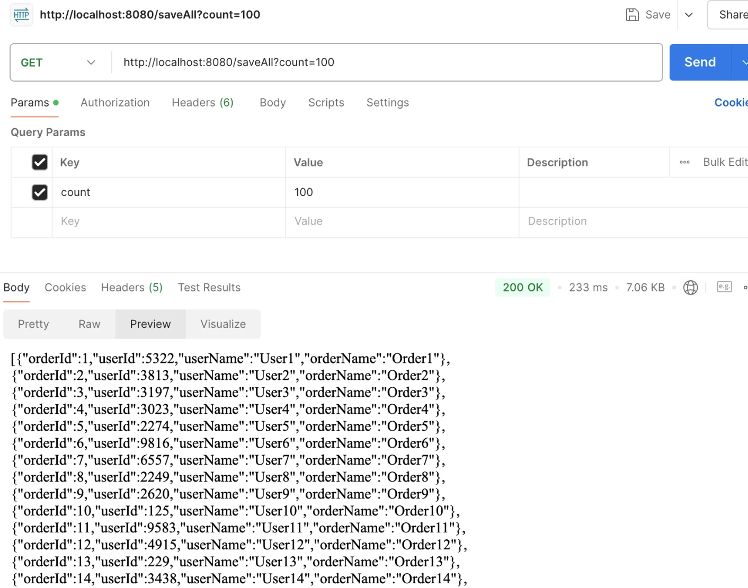
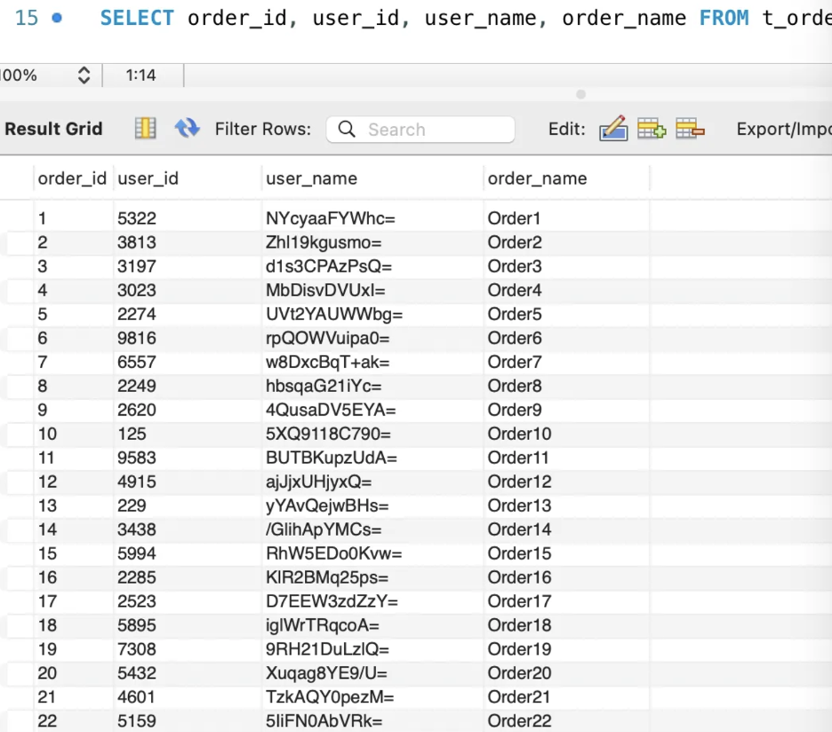
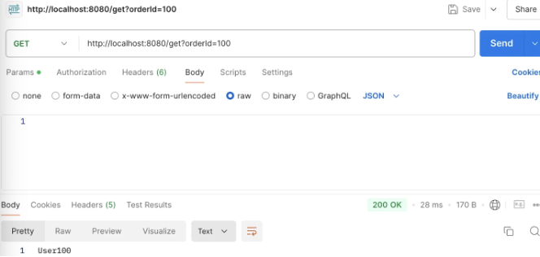

# Capstone_AutomaticED

## 1. Project Title

**Performance Optimization and Enhanced Encryption in Automatic Data Encryption Systems for Large-Scale Databases**

## 2. Project Description

This project focuses on improving the performance of encryption algorithms used in automatic encryption and decryption systems for sensitive data in large-scale databases. The original system used the DES (Data Encryption Standard) algorithm, which has limitations in both security and performance, particularly when dealing with large datasets.

The goal of this project is to optimize the system by replacing DES with the more secure and efficient AES (Advanced Encryption Standard). This README will guide users through setting up the system, testing its features, and understanding the rationale behind this improvement.

## 3. Original Paper Overview

The system is based on a design from the original paper:
- **Reference**: Zhang, X., Hu, H., & Xu, Y. (2024). The Design and Implementation of an Automatic Encryption and Decryption System for Sensitive Words in Databases Based on Spring Boot. *2024 5th International Seminar on Artificial Intelligence, Networking, and Information Technology (AINIT)*, IEEE. DOI: 10.1109/AINIT61980.2024.10581490. [Link to paper](https://ieeexplore.ieee.org/document/10581490)

## 4. Problem Statement

DES, while functional for smaller datasets, is outdated and inefficient for modern large-scale applications. Its 56-bit key is susceptible to brute-force attacks, and performance issues arise when scaling to larger datasets. 

**Proposed Improvement**: This project proposes replacing DES with AES, which provides stronger security with key sizes of 128, 192, and 256 bits and significantly faster encryption speeds.

## 5. Impact of Improvement

The transition to AES will:
- Enhance the system’s **security** by eliminating vulnerabilities in the DES algorithm.
- Improve **performance** when handling large-scale datasets, making the system more suitable for real-world enterprise applications.
  
The performance of DES and AES will be compared using various datasets to quantify these improvements.

## 6. Project Scope

- **Algorithm Optimization**: Replace DES with AES and optimize the system to handle large datasets efficiently.
- **Performance Enhancement**: Measure encryption and decryption times for both algorithms and compare their effectiveness.
- **Testing with Large Datasets**: Run tests with large datasets to ensure the system performs well in enterprise-scale environments.

## 7. Technology Stack

- **Languages**: Java
- **Framework**: Spring Boot, Spring Data JPA
- **Encryption Libraries**: Java Cryptography Extension (JCE) for AES implementation
- **Database**: MySQL
- **Tools**: JUnit for performance testing, SLF4J for logging

---

## 8. Setup

### Prerequisites
- Java 11+
- Maven 3.x
- A MySQL or PostgreSQL database (or your choice of database) for storing the data
- Postman or any API testing tool

### Steps:

1) **Clone the Repository**
    ```bash
    git clone https://github.com/your-repo/automaticed.git
    cd automaticed
    ```

2) **Set Up the Database**
    Create a database named `capstoneDatabase`. Update your `application.properties` file with the correct connection details:
    ```properties
    spring.datasource.url=jdbc:mysql://localhost:3306/capstoneDatabase
    spring.datasource.username=your_db_user
    spring.datasource.password=your_db_password
    spring.jpa.hibernate.ddl-auto=update
    ```

3) **Build the Project**
    ```bash
    mvn clean install
    ```

4) **Run the Application**
    ```bash
    mvn spring-boot:run
    ```

---

## 9. API Endpoints

### 1) **Encrypt Data (DES/AES)**
Encrypt sensitive data using the AES or DES algorithm.

- **Endpoint**: `/encrypt`
- **Method**: `GET`
- **Parameters**:
  - `plaintext` (String): The text to be encrypted.
  - `algorithm` (String): The encryption algorithm (DES or AES).
- **Example**: `/encrypt?plaintext=HelloWorld&algorithm=AES`

### 2) **Decrypt Data (DES/AES)**
Decrypt AES or DES-encrypted data.

- **Endpoint**: `/decrypt`
- **Method**: `GET`
- **Parameters**:
  - `ciphertext` (String): The encrypted text to be decrypted.
  - `algorithm` (String): The algorithm used for decryption.
- **Example**: `/decrypt?ciphertext=GeXlTVTmmwZZ2FKFmUCVpQ==&algorithm=AES`

### 3) **Save Orders**
Save multiple orders with randomly generated `user_name` values, which will be encrypted before saving to the database.

- **Endpoint**: `/saveAll`
- **Method**: `GET`
- **Parameters**:
  - `count` (Integer): Number of random orders to generate and save.
- **Example**: `/saveAll?count=100`

### 4) **Get Order by ID**
Retrieve the decrypted `user_name` for a specific order.

- **Endpoint**: `/get`
- **Method**: `GET`
- **Parameters**:
  - `orderId` (Long): The ID of the order to retrieve.
- **Example**: `/get?orderId=100`

### 5) **Get Paginated Orders**
Retrieve a paginated list of orders.

- **Endpoint**: `/getAllByPage`
- **Method**: `GET`
- **Parameters**:
  - `pageNo` (int): The page number to retrieve.
  - `pageSize` (int): The size of the page.
- **Example**: `/getAllByPage?pageNo=0&pageSize=10`

### 6) **Save Orders Manually**
Save a list of orders with their details manually provided.

- **Endpoint**: `/saveByOneself`
- **Method**: `POST`
- **Request Body**: A list of `OrderEntity` objects in JSON format.
- **Example**: `/saveByOneself`

---

## 10. Testing the Application 

You can test the API endpoints using tools like **Postman** or **Curl**. For example, to encrypt a string using DES:

```bash
curl -X GET "http://localhost:8080/encrypt?plaintext=HelloWorld&algorithm=DES"
```

---

## 11. How It Works

1. **Encryption and Decryption**: The `CryptoUtil` class is used to encrypt and decrypt sensitive information using either the DES or AES algorithm.
2. **Order Management**: Orders are saved and retrieved via the `OrderService`, which interacts with the database. Sensitive information is encrypted before being saved.
3. **Performance Monitoring**: The `saveAll` endpoint logs execution times to monitor performance.

---

## 12. Initial Test Records
We primarily use Postman to run the initial test. The process and results are as follows:

1. **Run the Test via Maven**: Maven will execute all the tests in the project, including the AutomaticEdApplicationTests class.
We passed the test:


2. **Encrypt and Decrypt Process for Specific Text**:
   a. **Encrypt**: For example, we encrypt a sensitive information user_name, which is “Hello World!”, and the result(test using Postman) is as follows:

  b. **Decrypt**: We use the ciphertext “GeXlTVTmmwZZ2FKFmUCVpQ==” to decrypt the sensitive information, which we got result as follows:


3. **Test for Automatic Encrypt for Sensitive Words**: Run the Application and Test auto encrypt and save to the Database, and then decrypt one of them.
   a. **Encrypt and Save to Database**: Generate 100 random users in Postman, encrypt their “user_name”, then save to database:

   
   b. **Check for Encryption**: Check the data in the “t_order” table, we can see all the “user_name” have been encrypted.


4. **Test for Automatic Decryption for Specific Word**: Get data according to the specified order_id (100 in this test): we can see that application have retrieved the decrypted user_name which order_id = 100.


---

## 13. License

This project is licensed under the MIT License. See the `LICENSE` file for details.
